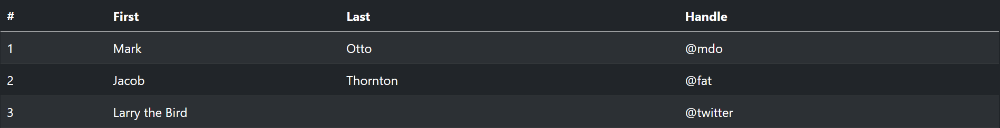
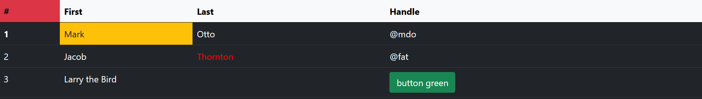

# Tynamic

The library is implementation in pure JavaScript. With this library you can render a virtual table dynamically.

You can get start with interactive version here: https://maxeo.github.io/tynamic/demo/

## Usage

### Standard bootstrap table without library

```html
<table id="test1" class="table table-dark table-striped">
    <thead>
    <tr>
        <th>#</th>
        <th>First</th>
        <th>Last</th>
        <th>Handle</th>
    </tr>
    </thead>
    <tbody>
    <tr>
        <td>1</td>
        <td>Mark</td>
        <td>Otto</td>
        <td>@mdo</td>
    </tr>
    <tr>
        <td>2</td>
        <td>Jacob</td>
        <td>Thornton</td>
        <td>@fat</td>
    </tr>
    <tr>
        <td>3</td>
        <td colspan="2">Larry the Bird</td>
        <td>@twitter</td>
    </tr>
    </tbody>
</table>
```



### Standard bootstrap table with library:

#### HTML

```html
<table id="test2" class="table table-dark table-striped">
</table>
```

#### JAVASCRIPT

```javascript
tynamic.updateTable(
    document.getElementById("test2"),
    {
        'head': ['#', 'First', 'Last', 'Handle'],
        'body': [
            [1, 'Mark', 'Otto', '@mdo'],
            [2, 'Jacob', 'Thornton', '@fat'],
            [3, {'html': 'Larry the Bird', 'attr': {'colSpan': 2}}, '@twitter'],
        ]
    },
)
```

#### RESULT


### Alternative usage:

#### HTML

```html
<table id="test3" class="table table-dark table-striped">
</table>
```

#### JAVASCRIPT

```javascript
tynamic.updateTable(
    document.getElementById("test3"),
    {
        'data': [
            {
                '#': 1,
                'First': 'Mark',
                'Last': 'Otto',
                'Handle': '@mdo',
            },
            {
                '#': 2,
                'First': 'Jacob',
                'Last': 'Thornton',
                'Handle': '@fat',
            },
            {
                '#': 3,
                'First': {'html': 'Larry the Bird', 'attr': {'colSpan': 2}},
                'Handle': '@twitter',
            },
        ]
    },
)
```

#### RESULT


### Custom usage:

#### HTML

```html
<table id="test4" class="table table-dark">
</table>
```

#### JAVASCRIPT

```javascript
tynamic.updateTable(
    document.getElementById("test4"),
    {
        'head': {
            'class': "table-light",
            'data': [{'html': '#', 'class': 'bg-danger'}, 'First', 'Last', 'Handle'],
        },
        'body': {
            'class': 'table-dark',
            'data': [
                [{'tag': 'th', 'html': 1}, {'html': 'Mark', 'class': 'bg-warning text-dark'}, 'Otto', '@mdo'],
                [2, 'Jacob', {'html': 'Thornton', 'attr': {'title': 'custom', 'style': 'color:red'}}, '@fat'],
                [3, {'html': 'Larry the Bird', 'attr': {'colSpan': 2}}, {'html': '<button class="btn btn-success">button green</button>', 'f': 'clickMe'}],
            ]
        }
    }, {
        clickMe: function (data, td) {
            let btn = td.querySelector('button');
            btn.addEventListener('click', function () {
                if (btn.classList.contains('btn-success')) {
                    btn.innerHTML = 'button red';
                    btn.classList.remove('btn-success');
                    btn.classList.add('btn-danger');
                } else {
                    btn.innerHTML = 'button green';
                    btn.classList.add('btn-success');
                    btn.classList.remove('btn-danger');
                }

            })
        }
    }
)
```

#### RESULT




### Try yourself:

You can [Click here](https://jsfiddle.net/maxeo/phmyq3us/4/) to test you custom code